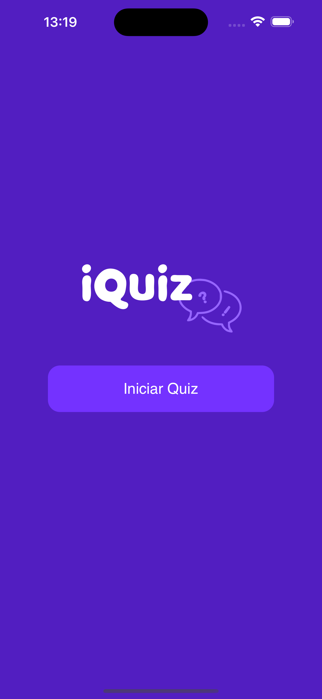

# iOS: Construindo seu primeiro aplicativo
Repositório do curso iOS: Construindo seu primeiro aplicativo da Alura.
## Conceitos abordados:
- UIKit vs SwiftUI
- Storyboard
- Constraints
- Autolayout
- Navegação entre telas
- Passagem de parâmetros entre telas
- Criação de modelos para representar dados
- Elementos dinâmicos

## Screenshots:
  
